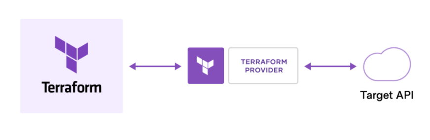

## This is the first practical of terraform

### EC2 creation
- You should have AWS account
- Install visual studio code, git bash, aws cli(I am doing in windows)
- Refer (https://docs.aws.amazon.com/cli/latest/userguide/getting-started-install.html) to install aws cli
- Create IAM programatic user
- Write provider (in this case AWS)
- Provide credentials to terraform (terraform need to authenticate before creating the resources)
- Write ec2 terraform file

terraform version different, provider version is different.

### Commands
- Run the below to intialize the directory
```
terraform init
```
init command will create .terraform directory, .terraform.lock.hcl files in your folder <br />
**NOTE:** you need to ignore .terraform directory(refer .gitignore file). .terraform.lock.hcl file should not be ignore, it should be maintained in repository.
- Run the below command to check the resources
```
terraform plan
```
- Run the below command to apply
```
terraform apply
```
- Run the below command to destroy resources
```
terraform destroy
```
**NOTE:** AMI is different for every region, make sure you get the AMI same as the region you gave in provider.tf

### Syntax
Common HCL syntax is as below.
```
resource "type-of-resource-from-provider" "your-friendly-name" {
    argument-1 = ""
    argument-2 = ""
}
```
### How terraform works?


