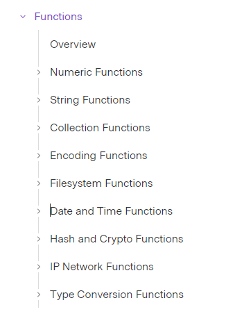

### Functions in terraform
Function meaning is  
- Takes input 0 to many
- Do some work
- Return something

Terraform does not support user defined functions like traditional scripting/programming languages. We must use built in functions, thank god otherwise we need to write alot :P

We have below type of functions

